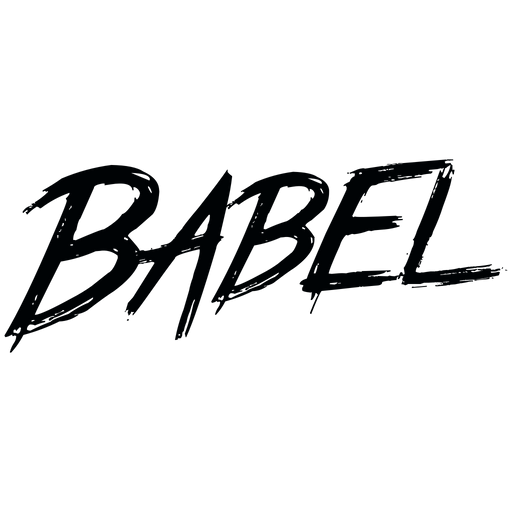

<h1 align="center">Hi 👋, I'm Danish Khan</h1>
<h3 align="center">An aspiring Full Stack Web Developer currently studying at Masai School.</h3>
<h5 align="center">Welcome to my GitHub profile!</h5>

## About Me

🌐 Exploring the world of web development.

🚀 Enthusiastic about learning new technologies.

💻 Currently mastering HTML, CSS, JavaScript, and Python.

🎓 Studying at [Masai School](https://www.masaischool.com/).

📩 Email - **danishk0687@gmail.com**

📔 Resume - [Resume](https://test-resume.masaischool.com/dashboard/profile/?selectedTemplate=ModernMilestone&isEdit=true&resumeId=6569fdd7436c6b8b69f3e0f4&profileId=self)

💼 Portfolio - [link](link)

<h3 align="left">Connect with me:</h3>

&nbsp;&nbsp;
&nbsp;&nbsp;

<h3 align="left">Languages and Tools:</h3>

 
 &nbsp;&nbsp;
&nbsp;&nbsp;
 &nbsp;&nbsp;
 &nbsp;&nbsp;
 &nbsp;&nbsp;
 &nbsp;&nbsp;
  
 &nbsp;&nbsp;
&nbsp;&nbsp;
&nbsp;&nbsp;
 &nbsp;&nbsp;

&nbsp;
 

 

 

<!--
**danishkhan424/danishkhan424** is a ✨ _special_ ✨ repository because its `README.md` (this file) appears on your GitHub profile.

Here are some ideas to get you started:

- 🔭 I’m currently working on ...
- 🌱 I’m currently learning ...
- 👯 I’m looking to collaborate on ...
- 🤔 I’m looking for help with ...
- 💬 Ask me about ...
- 📫 How to reach me: ...
- 😄 Pronouns: ...
- ⚡ Fun fact: ...
-->
